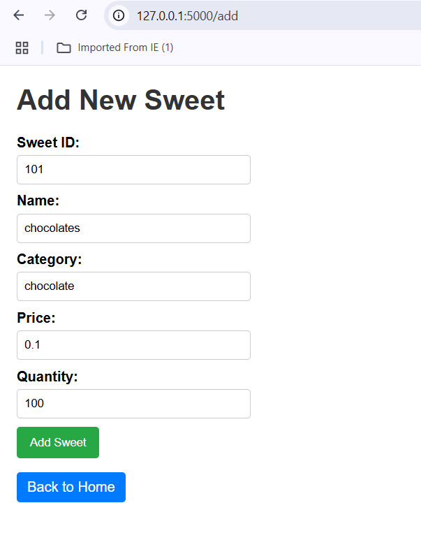
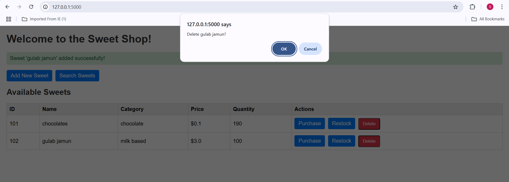
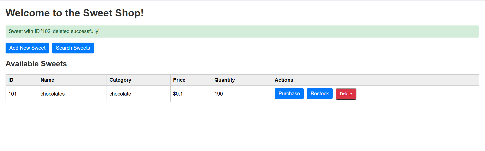
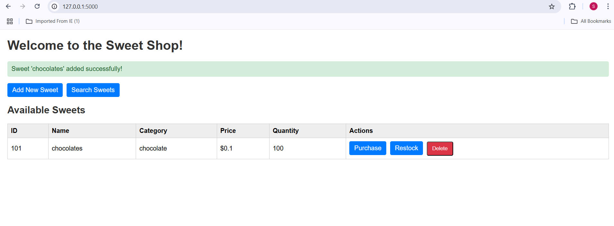
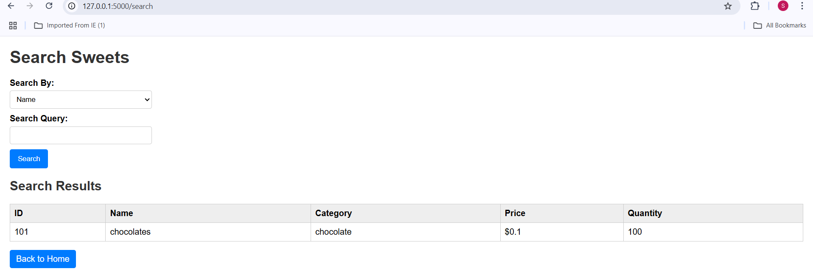
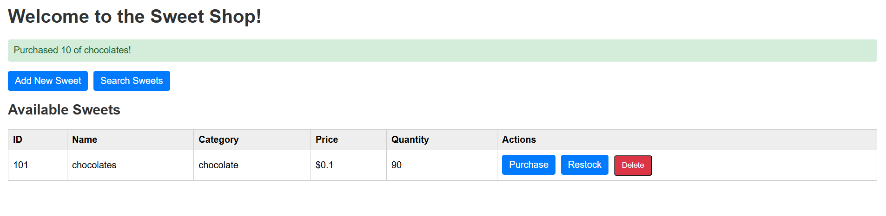
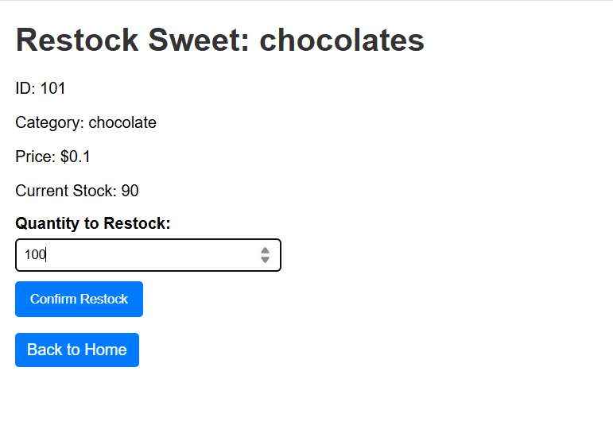

# Sweet Shop Management System in Python 

## Introduction
The Sweet Shop Management System is developed using Test-Driven Development (TDD) principles, ensuring that all implemented features are thoroughly tested for reliability.

## Features

### Add Sweets  
- Allows users to add new sweets to the shop with validation.  
- Ensures that sweets with duplicate IDs are not added.  
- Validates that all required fields (ID, name, category, price, quantity) are present.  



---

### Delete Sweets  
- Allows users to remove sweets from the shop.  
- Validates that the sweet exists before deletion.  



**Alternative Delete View:**  


---

### View Sweets  
- Allows users to view a list of all available sweets in the shop.  
- Validates and raises an error if no sweets are available.  



---

### Search Sweets  
- Allows users to search for sweets by name, category, or price range.  



---

### Purchase Sweets  
- Allows users to "purchase" sweets, decreasing their quantity in stock.  
- Validates that the sweet is available and there is sufficient stock.  



---

### Restock Sweets  
- Allows users to increase the quantity of sweets in stock.  
- Validates that the sweet exists before restocking.  



---

## Requirements
- Python 3.x

## Setup & Installation

### Clone the Repository
```bash
git clone https://github.com/Sneha-Choudhary2/sweet-shop-management
cd sweet-shop-management-system
